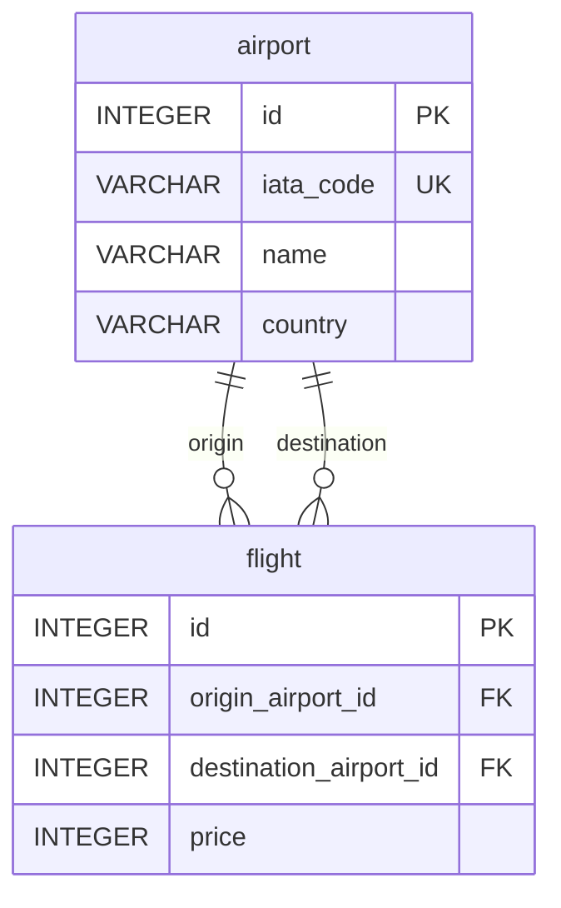

# Flight Routes API

REST API для управления аэропортами, рейсами и поиска самого дешёвого маршрута между двумя точками — включая перелёты с одной пересадкой.

Веб-интерфейс не предусмотрен: только HTTP JSON API.

> Сейчас реализован CRUD аэропортов. Рейсы и поиск маршрута — следующий этап.

## Стек

| Слой | Технология |
| --- | --- |
| Язык | Go 1.25 |
| HTTP | `net/http`, `ServeMux` — без фреймворков |
| БД | SQLite (`modernc.org/sqlite`, без CGO) |
| Конфиг | `.env` + `cleanenv` |
| Логи | `zap` |
| Архитектура | Handler → Service → Repository |

## Архитектура

Слои разделены по MVC(S): хендлер принимает запрос, сервис валидирует и содержит бизнес-логику, репозиторий ходит в SQLite.

```
┌─────────────┐     ┌─────────────┐     ┌──────────────┐     ┌────────┐
│   handler   │ ──► │   service   │ ──► │  repository  │ ──► │ SQLite │
└─────────────┘     └─────────────┘     └──────────────┘     └────────┘
        │
        ▼
┌─────────────────┐
│ error middleware│  статус и JSON по sentinel-ошибке
└─────────────────┘
```

Неизвестные ошибки БД не утекают клиенту: репозиторий оборачивает их в `ErrInternal`, middleware отдаёт `500` и пишет оригинал в лог.

```
cmd/main.go                  точка входа, роутинг, graceful interrupt
internal/
  config/                    переменные окружения
  handler/                   HTTP-хендлеры и JSON request/response
  service/                   валидация и бизнес-логика
  repository/                SQL
  sqlite/                    подключение и миграция схемы
  middleware/                маппинг ошибок в HTTP
  error/                     константные ошибки API
  model/                     доменные структуры
db/                          файл SQLite
```

## База данных

Две связанные таблицы. Схема создаётся при старте (`CREATE TABLE IF NOT EXISTS`).



### `airport`

| Колонка | Тип | Ограничения |
| --- | --- | --- |
| `id` | INTEGER | PK, AUTOINCREMENT |
| `iata_code` | VARCHAR(3) | UNIQUE NOT NULL, например `JFK`, `SVO`, `LHR` |
| `name` | VARCHAR | NOT NULL |
| `country` | VARCHAR | NOT NULL |

### `flight`

| Колонка | Тип | Ограничения |
| --- | --- | --- |
| `id` | INTEGER | PK, AUTOINCREMENT |
| `origin_airport_id` | INTEGER | FK → `airport.id` |
| `destination_airport_id` | INTEGER | FK → `airport.id` |
| `price` | INTEGER | NOT NULL, цена в копейках |

Между двумя аэропортами в одном направлении может быть только один тариф: `UNIQUE(origin_airport_id, destination_airport_id)`.

Цена в модели и БД — целые копейки. Хендлер мапит домен в response и отдаёт рубли: `15.99` = 1599 копеек. Если база уже создана со старой схемой (`DECIMAL`), удали `db/flight-routes.db` и подними сервер заново.

## API

Базовый префикс: `/api`. Тело запросов и ответов — JSON. Поля `price` и `totalPrice` — рубли с двумя знаками, например `15.99`.

### Аэропорты

| Метод | Путь | Описание | Статусы |
| --- | --- | --- | --- |
| `GET` | `/api/airports` | Список аэропортов | `200`, `500` |
| `GET` | `/api/airport/{iataCode}` | Аэропорт по IATA-коду | `200`, `400`, `404`, `500` |
| `POST` | `/api/airports` | Создать аэропорт | `200`, `400`, `409`, `500` |

`iataCode` — ровно 3 символа. `name` и `country` — от 3 до 64 символов.

**Список**

```http
GET /api/airports
```

```json
[
  {
    "id": 1,
    "iataCode": "JFK",
    "name": "John F. Kennedy International",
    "country": "USA"
  },
  {
    "id": 2,
    "iataCode": "SVO",
    "name": "Sheremetyevo",
    "country": "Russia"
  }
]
```

**Один аэропорт**

```http
GET /api/airport/JFK
```

**Создание**

```http
POST /api/airports
Content-Type: application/json

{
  "iataCode": "LHR",
  "name": "Heathrow",
  "country": "United Kingdom"
}
```

Ответ — созданная запись с `id`. Повтор того же `iataCode` даёт `409`.

### Рейсы

| Метод | Путь | Описание | Статусы |
| --- | --- | --- | --- |
| `GET` | `/api/flights` | Все рейсы со вложенными аэропортами | `200`, `500` |
| `GET` | `/api/flights?from={iata}&to={iata}` | Прямой рейс между двумя аэропортами | `200`, `400`, `404`, `500` |
| `POST` | `/api/flights` | Добавить рейс | `201`, `400`, `404`, `409`, `500` |
| `PATCH` | `/api/flights?from={iata}&to={iata}` | Обновить цену | `200`, `400`, `404`, `500` |

`DELETE` не реализуется.

Без query — список. С `from` и `to` — один рейс (объект, не массив). Если указан только один параметр или код не из 3 символов — `400`. Если прямого рейса нет — `404`.

```http
GET /api/flights?from=JFK&to=LHR
GET /api/flights?from=SVO&to=JFK
GET /api/flights?from=JFK&to=HND
```

**Создание**

```http
POST /api/flights
Content-Type: application/json

{
  "originIataCode": "JFK",
  "destinationIataCode": "SVO",
  "price": 400.00
}
```

`404` — если один из аэропортов не существует. `409` — если тариф в этом направлении уже есть.

**Обновление цены**

```http
PATCH /api/flights?from=JFK&to=SVO
Content-Type: application/json

{
  "price": 420.50
}
```

### Поиск маршрута *(в разработке)*

```http
GET /api/search?from=JFK&to=SVO
```

Ищем самый дешёвый вариант: прямой рейс **или** маршрут с одной пересадкой. Если вариантов несколько — берём минимальный `totalPrice`. Если ничего нет — `404`.

Аэропорты — узлы направленного графа, рейсы — рёбра с весом `price`.

```json
{
  "origin": "JFK",
  "destination": "SVO",
  "totalPrice": 650.00,
  "route": [
    {
      "flightId": 12,
      "originAirport": {
        "id": 1,
        "iataCode": "JFK",
        "name": "John F. Kennedy International",
        "country": "USA"
      },
      "destinationAirport": {
        "id": 3,
        "iataCode": "LHR",
        "name": "Heathrow",
        "country": "United Kingdom"
      },
      "price": 400.00
    },
    {
      "flightId": 15,
      "originAirport": {
        "id": 3,
        "iataCode": "LHR",
        "name": "Heathrow",
        "country": "United Kingdom"
      },
      "destinationAirport": {
        "id": 2,
        "iataCode": "SVO",
        "name": "Sheremetyevo",
        "country": "Russia"
      },
      "price": 250.00
    }
  ]
}
```

## Ошибки

Любая ошибка — JSON:

```json
{
  "error": "airport not found"
}
```

| Статус | Когда |
| --- | --- |
| `400` | Невалидный JSON, формат `iataCode` / `name` / `country` |
| `404` | Аэропорт, рейс или маршрут не найден |
| `409` | Аэропорт или рейс уже существует |
| `500` | Внутренняя ошибка. Клиенту всегда `internal server error` |

Хендлеры возвращают `error`, middleware сравнивает её с константами из `internal/error` и выставляет статус. Текст может быть динамическим, например `Неверный iataCode: ru`.

## Запуск

Нужен Go 1.25+.

```bash
cp .env-example .env
go run ./cmd
```

Сервер слушает `http://localhost:8080`.

```bash
curl http://localhost:8080/api/airports

curl -X POST http://localhost:8080/api/airports \
  -H "Content-Type: application/json" \
  -d '{"iataCode":"SVO","name":"Sheremetyevo","country":"Russia"}'

curl http://localhost:8080/api/airport/SVO
```

Файл БД по умолчанию: `db/flight-routes.db`. WAL-файлы (`*-shm`, `*-wal`) в git не входят.

## Конфигурация

Значения читаются из `.env` (см. `.env-example`).

| Переменная | По умолчанию | Описание |
| --- | --- | --- |
| `SERVER_HOST` | `localhost` | Хост HTTP-сервера |
| `SERVER_PORT` | `8080` | Порт |
| `DB_PATH` | `db/flight-routes.db` | Путь к SQLite |
| `DB_MODE` | `rwc` | Режим открытия (`rwc` — создать, если нет) |
| `DB_CACHE_SIZE` | `2000` | Кэш SQLite, КБ |
| `DB_SYNC_MODE` | `normal` | `synchronous` |
| `DB_BUSY_TIMEOUT_SECONDS` | `5` | Таймаут блокировки |
| `DB_QUERY_TIMEOUT_SECONDS` | `30` | Таймаут ping при старте |
| `DB_MAX_OPEN_CONNS` | `1` | Пул соединений (SQLite) |
| `DB_MAX_IDLE_CONNS` | `1` | Idle-соединения |
| `DB_CONN_MAX_LIFETIME_SECONDS` | `0` | `0` — без ограничения |

Для SQLite обычно оставляют `MaxOpenConns=1`: одна писательская транзакция в момент времени. Включены WAL и foreign keys.